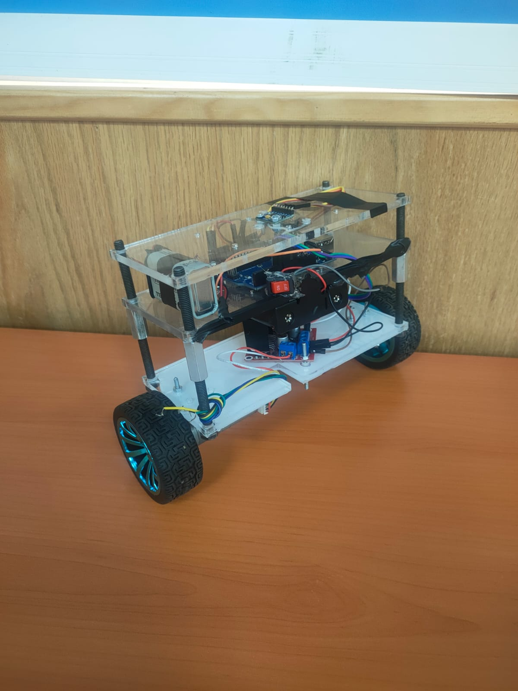

# Self-Balancing Robot

  

## Abstract
The Self-Balancing Robot is a two-wheeled mobile robot designed to maintain its upright position autonomously using the inverted pendulum principle. The robot continuously measures its tilt angle with an MPU6050 Inertial Measurement Unit (IMU) and uses a PID (Proportional–Integral–Derivative) controller to calculate the required motor commands for maintaining balance. By continuously adjusting the speed and direction of the two DC motors, the robot compensates for disturbances and remains stable in real time.

This project demonstrates the application of embedded systems, feedback control, sensor integration, and motor control in robotics. It provides a practical platform for understanding control theory, real-time programming, and autonomous mobile robot development, and can be extended with features such as remote control, obstacle avoidance, or autonomous navigation.

---
## System Architecture
The self-balancing robot operates using a closed-loop feedback control system. An MPU6050 inertial measurement unit (IMU) continuously measures the robot's tilt angle and angular velocity. These measurements are processed by the microcontroller, which computes the robot's orientation and compares it with the desired upright position. A PID controller calculates the appropriate control signal based on the angle error and sends PWM commands to the motor driver. The motor driver adjusts the speeds and directions of the two DC motors, allowing the robot to move beneath its center of gravity and maintain balance. This feedback loop runs continuously in real time to ensure stable and responsive operation.

## Electrical System
- Arduino UNO
- MPU6050 (IMU)
- L298N Motor Driver 
- 2 DC  Motors
- 2 Wheels
- Rechargeable Lithium Battery Pack
- Power Switch
- Robot Chassis

## Demonstration Video

  

    
  

